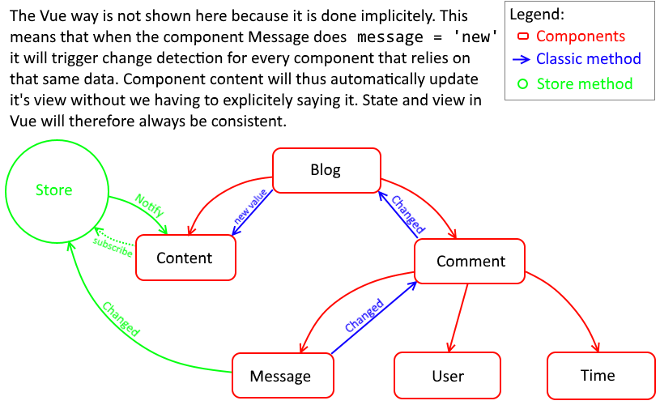

# demo

See other README.md's for some extra explanations.

## Resources

* Official guide: https://vuejs.org/v2/guide/
* Typescript usage for Vue: https://vuejs.org/v2/guide/typescript.html
* Vuex + TS: https://medium.com/coding-blocks/writing-vuex-modules-in-neat-typescript-classes-9bf7b505e7b5
  * I recommend this library if you use Vuex, just as with components, you can write vuex modules in logical typescript classes instead of the JS-like modules

## Some random graphic I used



## Project setup
```
npm install
```

### Compiles and hot-reloads for development
```
npm run serve
```

### Compiles and minifies for production
```
npm run build
```

### Run your tests
```
npm run test
```

### Lints and fixes files
```
npm run lint
```

### Customize configuration
See [Configuration Reference](https://cli.vuejs.org/config/).